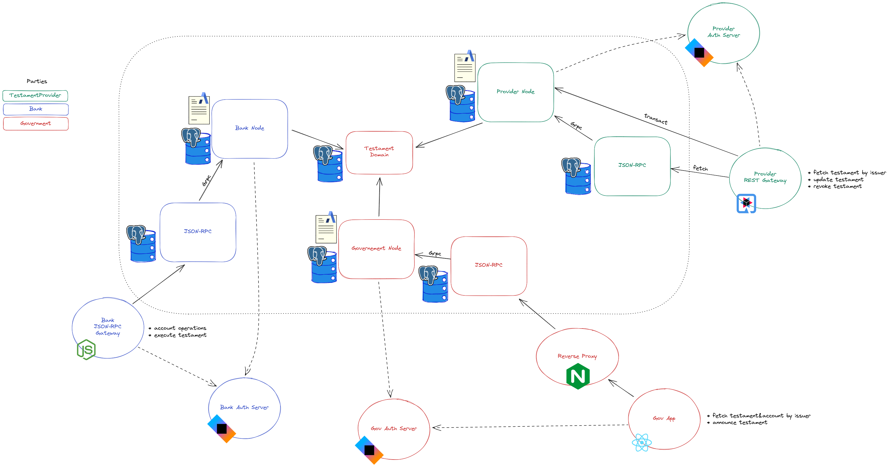

# Daml Testament

[Ethereum Testament](../ethereum/) ported to Daml. 
Personal sample repo to learn different Daml&Canton features.

[Excalidraw source](./diagram.excalidraw)

Network consists of 3 organizations:

* Provider - issue/update/revoke testaments
* Bank - holds user tokens; distributes them on testament execution
* Government - confirms all operations; announces testament execution

Repo consists of 7 directories:

* [auth-server](./auth-server/) - sample Ktor server for providing valid JWS/JWKS
* [bank-gateway](./bank-gateway) - JSON-RPC Node gateway to network for bank services
* [contracts](./contracts/) - Daml templates
* [gov-app](./gov-app) - governmental React application
* [k8s](./k8s) - Kubernetes deployment
* [network](./network/) - files required to run docker compose network
* [provider-gateway](./provider-gateway/) - REST Quarkus gateway to network for provider services

## Local deployment

Docker compose configuration is provided. 
So, to start all services issue `docker compose up`. Batteries included.

If you prefer (or need) to use Kubernetes check out [k8s](./k8s/) folder for instructions.

## Usage 

<!-- TODO: document happy-path usage -->
