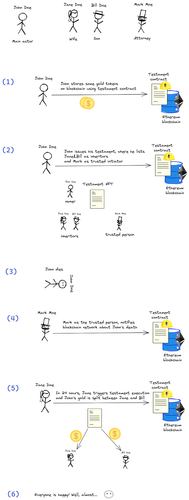
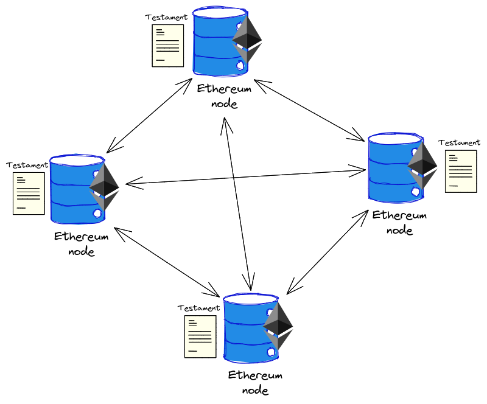

# Blockchain Testament

This is a POC contract. No production use intended.

## Table of Contents

- [Overview](#overview)
  - [Example use case](#example-use-case)
  - [Why the Blockchain](#why-the-blockchain)
- [Usage](#usage)
- [Development](#development)
  - [Testing](#testing)
- [Changelog](./CHANGELOG.md)

## Overview

ERC-1155 contract that stores imaginary FTs and adds an ability for users to issue their testaments.
Their possessions will be split per testament rules in case of confirmed death.

In general testament hold the following info:

- issuer
- inheritors and their shares
- trusted accounts (i.e. the ones trusted to announce death of the owner)

### Example use case:



[Excalidraw source](./assets/use-case.excalidraw)

### Why the Blockchain?

We could store our testaments in Postgres? It's common and cheap. Why bother?

Blockchain is distributed, thus trustless.
Once John stores his testament, he is sure that it will work exactly the way stated in the contract.



[Excalidraw source](./assets/blockchain-network.excalidraw)

## Usage

1. Install dependencies: `npm i`

2. Start local node: `npx hardhat node`

3. Deploy `Testament` contract `npx hardhat run scripts/deploy.ts --network localhost`

4. Start hardhat console `npx hardhat console --network localhost`

5. Variables set up:

```javascript
// contract address from step 3
const contractAddress = "0xe7f1725e7734ce288f8367e1bb143e90bb3f0512";
.load scripts/console-helper.js
```

6. Interact with contract:

```javascript
// transfer 1000 GOLD from contract deployer to contract user
// prettier-ignore
(await testament
  .connect(deployerSigner)
  .safeTransferFrom(deployer, user, GOLD, 1000, []));
// check user's gold balance
await testament.balanceOf(user, GOLD);
// create new testament
await testament.issueTestament({
  inheritors: [wife, son],
  shares: [4000, 6000], // 40% to wife & 60% to son
  notifiers: [attorney],
  executionDelay: 3600, // 1 hour
});
// fetch testament
await testament.fetchTestament(user);
// announce testament execution
await testament.connect(attorneySigner).announceExecution(user);
// decline testament execution
await testament.declineExecution();
// execute statement
await time.increase(3610); // forward 1 hour 10 seconds
await testament.execute(user);
await testament.balanceOf(wife, GOLD);
await testament.balanceOf(son, GOLD);
```

<!-- TODO: issue #3: etherscan verification section -->

<!-- TODO: issue #1: testnet deployment section -->

<!-- TODO: issue #4: deployment & usage prices estimations section -->

## Development

Contract follows official [Solidity style guide](https://docs.soliditylang.org/en/v0.8.9/style-guide.html).
Please, review it and follow in your PRs.

The following helper tools are used. Please, run them before raising the PR.

```bash
# hint solidity files
npx solhint 'contracts/**/*.sol'
npx solhint 'contracts/**/*.sol' --fix
# hint ts files
npx eslint '**/*.{js,ts}'
npx eslint '**/*.{js,ts}' --fix
# run prettier
npx prettier '**/*.{json,sol,md,ts,js}' --check
npx prettier '**/*.{json,sol,md,ts,js}' --write
```

On each build contract API docs are generated.
View them in the browser of your choice: `firefox docgen/index.html`.
Comments follow [Natspec format](https://docs.soliditylang.org/en/latest/natspec-format.html).

### Testing

Using Hardhat:

```bash
# run full suite
npx hardhat test
# run specific test
npx hardhat test --grep "Should issue testament"
# run tests with coverage
npx hardhat coverage
```

Using Mocha directly (works with extensions like [Mocha Test Explorer](https://marketplace.visualstudio.com/items?itemName=hbenl.vscode-mocha-test-adapter)):

1. Compile contracts manually: `npx hardhat compile`

2. Test:

```bash
# full suite
npx mocha
# specific test
npx mocha --grep "Should issue testament"
```

## AWS Deployment

1. Deploy AMB Ethereum node: `cd network-aws && cdk deploy`

2. Set `AWS_ETHEREUM_HTTP_ENDPOINT` in [network-aws/proxy/.env](./network-aws/proxy/.env) to AMB Ethereum http endpoint. 
See [aws network readme](./network-aws/README.md) on details how to retrieve it.

3. Start proxy locally: `cd network-aws/proxy && npm i && npm start`

4. Set correct `GOERLI_ACCOUNT_PRIVATE_KEY` in [.env](./.env)

5. Deploy contract: `npx hardhat run scripts/deploy.ts --network aws`

6. Start console: `npx hardhat console --network aws`

7. Interact with a contract:

```javascript
// contract address from step 3
const contractAddress = "0xe42a4018Df69cc4830Bdf99252763d4DD00f266B";

const [signer] = await ethers.getSigners();
const factory = await ethers.getContractFactory("Testament", signer);
const testament = await factory.attach(contractAddress);

// usage is the same as for local network, see examples from there
// note, however, that here you'll have as many signers as you specified 
// in hardhat.config.ts in `networks.aws.accounts` (1 by default)
await testament.balanceOf(signer.address, testament.GOLD());
```
